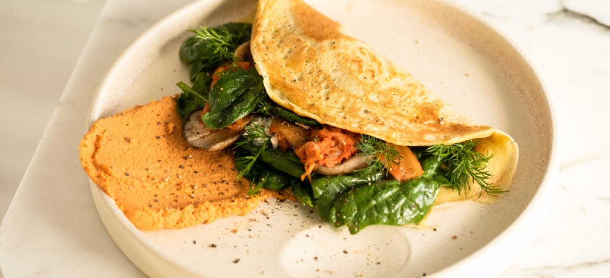

# Frontend Mentor - Recipe page solution

This is a solution to the [Recipe page challenge on Frontend Mentor]([https://www.frontendmentor.io/challenges/recipe-page-KiTsR8QQKm](https://www.frontendmentor.io/solutions/httpsgithubcomfrancisorocharecipepagemainblobmainstylecss-BJkiyHdYDL)). Frontend Mentor challenges help you improve your coding skills by building realistic projects. 

## Table of contents

- [Overview](#overview)
  - [The challenge](#the-challenge)
  - [Screenshot](#screenshot)
  - [Links](#links)
- [My process](#my-process)
  - [Built with](#built-with)
  - [What I learned](#what-i-learned)
  - [Continued development](#continued-development)
  - [Useful resources](#useful-resources)
- [Author](#author)
- [Acknowledgments](#acknowledgments)

## Overview

### Screenshot
- Desktop:


- Mobile: 


### Links

- Solution URL: [Add solution](https://www.frontendmentor.io/solutions/httpsgithubcomfrancisorocharecipepagemainblobmainstylecss-BJkiyHdYDL)
- Live Site URL: [Add live site URL here](https://francisorocha.github.io/recipe-page-main/)

## My process

### Built with

- Semantic HTML5 markup
- CSS custom properties
- Flexbox
- CSS Grid
- Mobile-first workflow


### What I learned

During this project, I learned a lot about responsive design and how to create interfaces that adapt to different devices and screen sizes. Here is a CSS code example showing how responsive design can be applied using media queries:

```html
<div id="container">
    <div id="one">
        <div class="image">
          
</div>
    <h1 class="title">Simple Omelette Recipe</h1>
```
```css
@media screen and (769px <= width <= 1024px){
    #container{
        width: 100%;
        margin: 0px;
        padding: 0px;
    }
}
```
In addition to responsive design, I also dove into improving web app accessibility. I learned the importance of correctly structuring HTML and using attributes like alt on images to improve the user experience for those with visual impairments. Here is an example of how to add the alt attribute to an image:
```

```
### Continued development

For my continued development, I would like to focus on the following areas:

Advanced JavaScript: I want to delve into more advanced JavaScript concepts, such as object-oriented programming, DOM manipulation, and using frameworks like React or Vue.js.

Advanced Responsive Design: Although I have learned the fundamentals of responsive design, I would like to explore more advanced techniques to create even more adaptive and optimized interfaces for a wide range of devices.

Web Accessibility: I will continue to improve my skills in creating accessible websites for people with disabilities, including implementing best practices such as semantic tags, aria attributes, and appropriate color contrasts.


### Useful resources

- [Media Query en CSS - Ancho de Pantalla Max y Min para Diseño Adaptable en Dispositivos Móviles]([https://www.example.com](https://www.freecodecamp.org/espanol/news/ejemplo-css-media-query-ancho-de-pantalla-max-y-min-para-diseno-adaptable-en-movil/)) - It helped me understand how to use media queries to create responsive designs on mobile devices. provided me with information on the specific syntax needed to set conditions based on the screen width, whether maximum or minimum. This allowed me to adjust the style of your website based on the screen size of the device it is viewed on, significantly improving the user experience on mobile devices.


## Author

- Github - [FrancisoRocha](https://github.com/FrancisoRocha)
- Frontend Mentor - [@FrancisoRocha](https://www.frontendmentor.io/profile/FrancisoRocha)
- Twitter - [@Francis99472176](https://twitter.com/Francis99472176)


